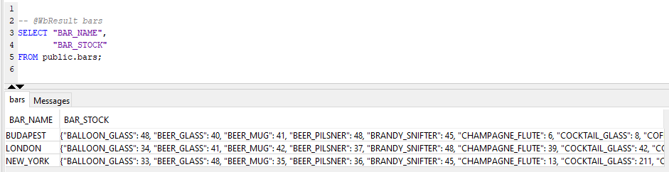
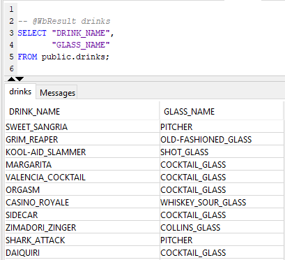
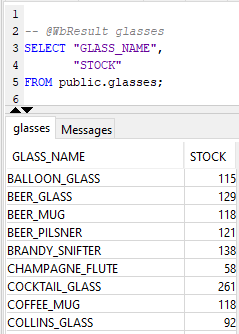
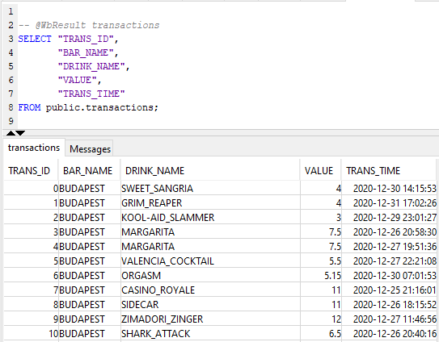

1. DB Design

    I used the free tier of AWS to create my PostgreSQL database. This was chosen out of convenience within the time constraints - I'm sure there are other options that would be better suited for this. I've also put the AWS instance username and password into my scripts to connect (sql_functions.py), again out of convenience. This is obviously not ideal for a production environment.

    I created 4 tables for the DB, these are as follows with their columns:

    i. bars

        BAR_NAME : String, primary key

        BAR_STOCK : JSON
        
    ii. drinks
        DRINK_NAME : String, primary key
        GLASS_NAME : String, foreign key (glasses.GLASS_NAME)
    iii. glasses
        GLASS_NAME : String, primary key
        STOCK : Integer
    iv. transactions
        TRANS_ID : Integer, primary key
        BAR_NAME : String, foreign key (bars.BAR_NAME)
        DRINK_NAME : String, foreign key (drinks.DRINK_NAME)
        VALUE : Float
        TRANS_TIME : DateTime (with timezone)

    The JSON in bars.BAR_STOCK is composed of a dictionary that holds stock for each glass type for that particular bar. For example, London may have "{'BALLOON_GLASS': 34, 'BEER_GLASS': 41, 'BEER_MUG': 42, ...}" as its BAR_STOCK. An alternate way to store this data in the bars table would be to have a separate stock column for every glass type that we encounter.

    The transactions.TRANS_TIME field includes timezone information. I added this to the design because the transaction data comes from bars that are all over the world. The timezones are mapped in the python scripts (parse_files.py) and are done so using the information in the raw filenames.

    The glasses.STOCK field is the overall total stock across all bars for each glass type. If I'd had more time I would have implemented this differently, so that a column for each bar's total stock (per glass type) would represent this data instead.

    I capitalised all string data and replaced any spaces with underscores - this is to ensure values are standardised between tables.

    Sample screenshots from each table:

    bars:

    

    drinks:

    

    glasses:

    

    transactions:

    

2. Limitations and Challenges

    One of the biggest challenges I found relating to sqlalchemy was writing some functionality to upsert data into a table. My upsert_df() function (in the sql_functions.py script) is a modified version of the second answer on this page: https://stackoverflow.com/questions/61366664/how-to-upsert-pandas-dataframe-to-postgresql-table. If I'd had more time I'd have liked to have come up with an original upsert function of my own. Another challenge was creating a table with an autoincrementing primary key. I have attempted to do this with the trans.TRANS_ID field (models.py), but I'm not sure if my implementation works exactly correctly. My solution as it is now uses the index of a dataframe to populate TRANS_ID, before it is committed to the DB.

    The functionality in the main script (parse_files.py) relies on some hardcoded mappings - for example, timezone and bar name mappings for the raw filenames. This is obviously a limitation as if more raw files are introduced, these will need to be updated for each and this could quickly become hard to maintain. I am not sure what the best way around this would be, but if the company was to move away from using raw files we wouldn't need to have this design anyway. There is a small amount of functionality with TheCocktailDB API (api_functions.py), this is to allow fetching of glass types for each unique drink. This funcionality would need to be greatly expanded in future to build a fully API based solution. Calling the API for every unique drink in the data also takes quite a while on my machine (parse_files.py, line 167-170). I wasn't able to come up with a quicker way to implement this in the time constraints.

3. Solution Overview

    models.py : Stores the sqlalchemy classes for each of our DB tables, also calls declarative_base() so we can inherit this into each DB table class.
    sql_functions.py : Stores most of the sqlalchemy functionality, including the upsert_df() function and the engine. This script should be run once to create all tables (line 88).
    file_functions.py : Stores functions related to moving/copying files and listing all files within a specific path.
    api_functions.py : Stores functions that use TheCocktailDB API.
    copy_files.py : Copies the raw files from a source directory to a queue directory.
    parse_files.py : Loads the data from the raw files stored in the queue into dataframes, one for each table. These dataframes are then passed into upsert_df() to upsert the data to the DB. This script should be scheduled to run frequently as per the DB update frequency requirements.
    local.ini : Config file that contains 3 parameters: RAW_DIR (where the raw files are initially coming from), QUEUE_DIR (where the raw files are processed), DEBUG (turn this on to disable file deletion and DB updates).
    unit_tests.py : Runs unit tests for functions defined elsewhere. I only had time to implement this for the format_stock() function (parse_files.py, lines 79-84).